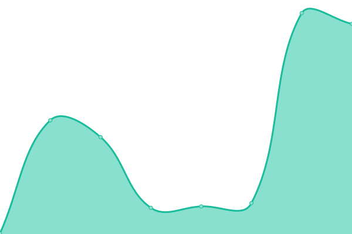
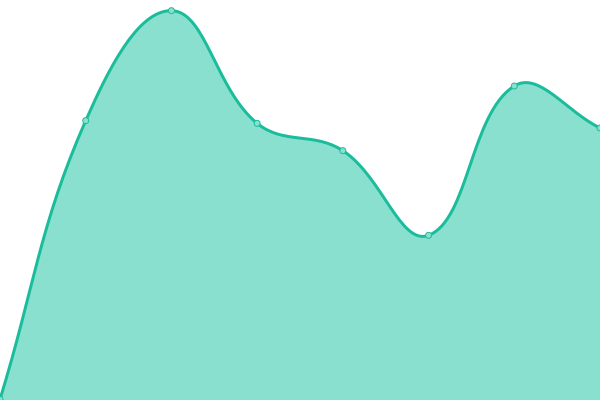
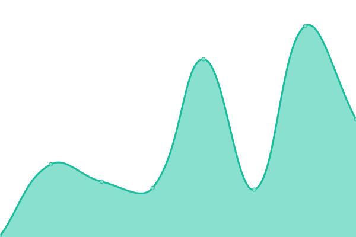
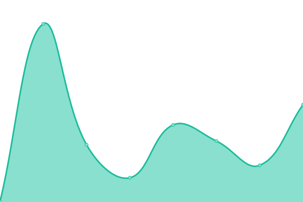

# [📈 Live Status](https://upptime.github.io/upptime): <!--live status--> **🟧 Partial outage**

This repository contains the open-source uptime monitor and status page for [Upptime](https://upptime.js.org), powered by [Upptime](https://github.com/upptime/upptime).

With [Upptime](https://upptime.js.org), you can get your own unlimited and free uptime monitor and status page, powered entirely by a GitHub repository. We use [Issues](https://github.com/upptime/upptime/issues) as incident reports, [Actions](https://github.com/unnamed-dot-group/upptime/actions) as uptime monitors, and [Pages](https://upptime.github.io/upptime) for the status page.

<!--start: status pages-->
<!-- This summary is generated by Upptime (https://github.com/upptime/upptime) -->
<!-- Do not edit this manually, your changes will be overwritten -->
<!-- prettier-ignore -->
| URL | Status | History | Response Time | Uptime |
| --- | ------ | ------- | ------------- | ------ |
|  [unnamed.group](https://unnamed.group) | 🟩 Up | [unnamed-group.yml](https://github.com/unnamed-dot-group/upptime/commits/HEAD/history/unnamed-group.yml) | 

 170ms
     
 | 

<a href="https://unnamed-dot-group.github.io/upptime/history/unnamed-group">100.00%</a>
    

|  [mastodon.unnamed.group](https://mastodon.unnamed.group) | 🟥 Down | [mastodon-unnamed-group.yml](https://github.com/unnamed-dot-group/upptime/commits/HEAD/history/mastodon-unnamed-group.yml) | 

 0ms
     
 | 

<a href="https://unnamed-dot-group.github.io/upptime/history/mastodon-unnamed-group">0.00%</a>
    

|  [uagpmc.com](https://uagpmc.com) | 🟩 Up | [uagpmc-com.yml](https://github.com/unnamed-dot-group/upptime/commits/HEAD/history/uagpmc-com.yml) | 

 411ms
     
 | 

<a href="https://unnamed-dot-group.github.io/upptime/history/uagpmc-com">0.00%</a>
    

|  [monsoonesports.org](https://monsoonesports.org) | 🟩 Up | [monsoonesports-org.yml](https://github.com/unnamed-dot-group/upptime/commits/HEAD/history/monsoonesports-org.yml) | 

 450ms
     
 | 

<a href="https://unnamed-dot-group.github.io/upptime/history/monsoonesports-org">100.00%</a>
    

|  [monsoon.team](https://monsoon.team) | 🟩 Up | [monsoon-team.yml](https://github.com/unnamed-dot-group/upptime/commits/HEAD/history/monsoon-team.yml) | 

 130ms
     
 | 

<a href="https://unnamed-dot-group.github.io/upptime/history/monsoon-team">100.00%</a>
    

|  [monsoon.academy](https://monsoon.academy) | 🟩 Up | [monsoon-academy.yml](https://github.com/unnamed-dot-group/upptime/commits/HEAD/history/monsoon-academy.yml) | 

 244ms
     
 | 

<a href="https://unnamed-dot-group.github.io/upptime/history/monsoon-academy">100.00%</a>
    

<!--end: status pages-->

[**Visit our status website →**](https://upptime.github.io/upptime)

## 📄 License

- Powered by: [Upptime](https://github.com/upptime/upptime)
- Code: [MIT](./LICENSE) © [Upptime](https://upptime.js.org)
- Data in the `./history` directory: [Open Database License](https://opendatacommons.org/licenses/odbl/1-0/)
